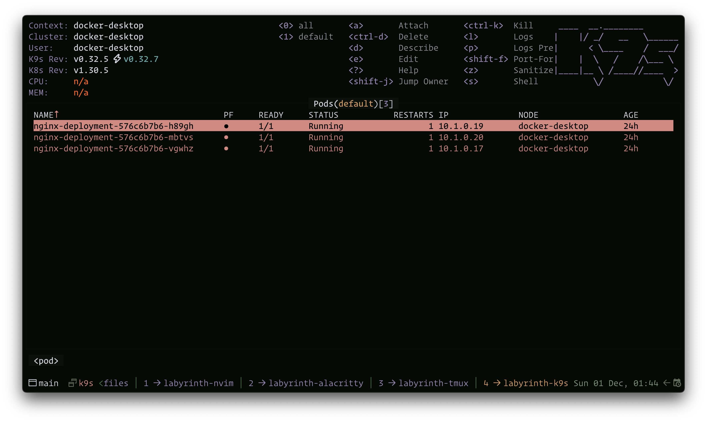
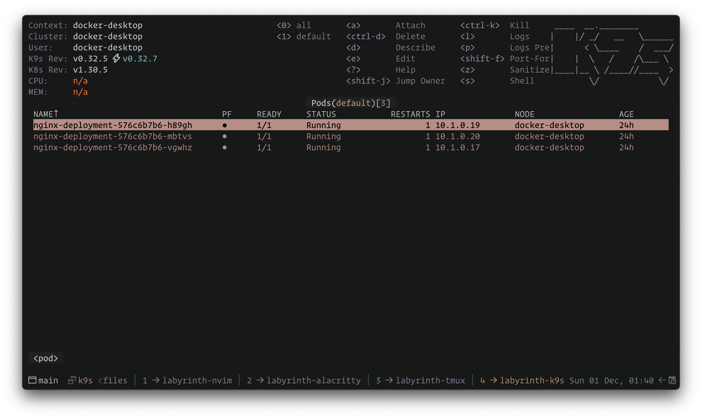

# 🌿 Labyrinth

Discover Labyrinth, a serene color scheme inspired by hidden pathways and mossy landscapes. Let its gentle tones guide your creativity with calm elegance.

Labyrinth provides four distinct variants with varying levels of contrast and color vibrancy to suit your preferences:

 - **Gloom**: The most contrasty variant, perfect for those who prefer sharp distinctions and vibrant colors.
 - **Dusk**: A balanced variant, offering a comfortable middle ground with moderate contrast and vibrancy.
 - **Mist**: The least contrasty variant, featuring the most gentle and subtle tones for a calm and unobtrusive interface.

Whether you're coding, designing, or simply exploring new aesthetics, Labyrinth adapts to your needs with its harmonious palette.

## Usage

1. Make sure `$XDG_CONFIG_HOME` is set as an evnironment variable
2. Create a folder called `k9s` under `$XDG_CONFIG_HOME`
3. Copy `skins` from this repository to the `k9s/skins` folder
4. Choose preferred skin in `k9s/config.yaml` under `k9s > ui > skin` (docs)[https://k9scli.io/topics/skins/]

## Gallery

**Labyrinth Gloom**

**Labyrinth Dusk**

**Labyrinth Mist**

